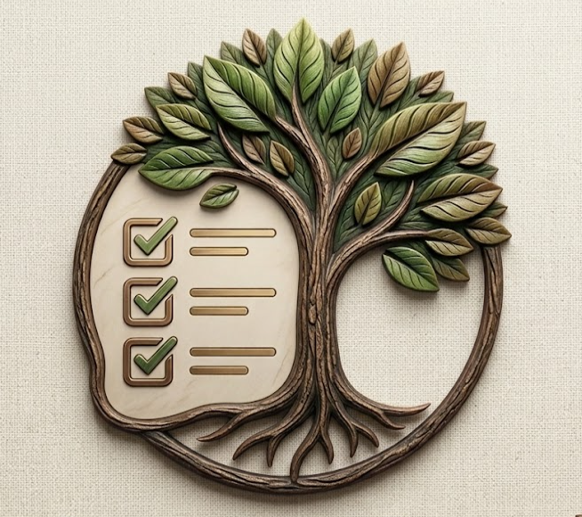

# <p align="center"><br>Fullstack ToDo Project 🌿</p>

<p align="center">
  <strong>A modern, full-stack Task Management application built with a focus on cutting-edge UI/UX (Glassmorphism), resilience, and analytical insights.</strong>
</p>

<p align="center">
  
  
  
  
  
</p>

---


---

## 🚀 Tech Stack
- **Backend**: C# .NET API (EF Core, Serilog)
- **Frontend**: React.js (Vite) + Lucide Icons
- **Database**: PostgreSQL
- **DevOps**: Docker & Docker Compose, GitHub Actions (CI)

## ✨ Features
1. **Glassmorphism Design**: High-end stunning visual effects, blur filters, scaled animations on hover, and custom smooth scrolling.
2. **Soft-Delete System**: Items go to a beautiful floating "Trash" (Кошик) UI from which they can be restored or hard-deleted.
3. **Optimistic UI Updates**: Interactions happen instantly on the UI. Failing API calls cleanly roll back to previous state.
4. **Resilient Circuit Breaker (Storage Mode)**: If PostgreSQL fails, the system automatically switches to local `App_Data/Saves/` JSON files! ☁️
5. **Bulk Operations & Analytics**: Multi-select support and an **Analytics Dashboard** rendering task distributions.
6. **Nature Facts API Integration**: Background API fetching ecosystem facts with fallback translations.

---

## 🏗️ How to Run Locally

1. Rename `.env.example` to `.env`.
2. Run in terminal:
```bash
docker-compose up -d --build
UI: http://localhost:5173

API: http://localhost:5186/api/todo

Українська Версія 🌿
✨ Ключові фічі
Дизайн Glassmorphism: Напівпрозорі матові інтерфейси та мікро-анімації.

Soft Delete (Кошик): Завдання потрапляють у кошик, звідки їх можна відновити або видалити назавжди.

Оптимістичний UI: Дії відображаються миттєво до відповіді сервера.

Fallback Storage Mode: Автоматичне перемикання на JSON-збереження при втраті зв'язку з БД.

Аналітичний дашборд: Графіки (Bar & Pie Charts) та масові дії з завданнями.

🏗️ Інструкція із Запуску (Docker)
Bash
docker-compose up -d --build
Frontend: http://localhost:5173

Backend API: http://localhost:5186

👤 Author
SadNapp

GitHub: @SadNapp
